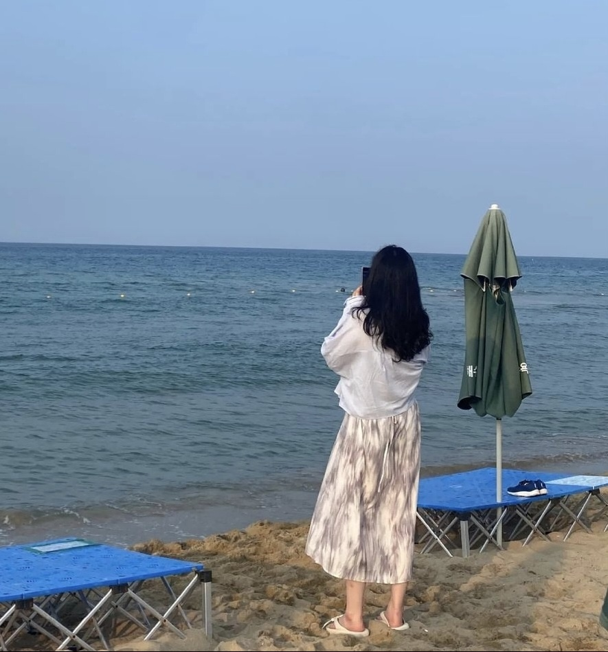

    

# React 공식문서 스터디👨‍💻

|인원 | 박수미, 임현아, 서샛별, 홍성빈 (강석우튜터님🤣)|
| --- | :-- |
|기간 | 2024-05-16~2024-06-14|
|목표 | React 공식 문서 완독하기|
| 내용 |<li>매주 React 공식 문서의 카테고리 2~3개 공부하기 *italic*(useImperativeHandle useInsertionEffect 제외)</li>
| |<li>매일 공부한 내용을 개인 블로그에 작성하여 dil에 블로그 링크 올리기</li>|
| |<li>presentation 폴더에 발표자료 올리기</li>|
| |<li>매주 금요일 랜덤으로 발표자 정하여 발표</li>|
| |<li>토의하여 모르는 부분 체크하고 정리하기</li>|

|  |  |  | |
| :---: | :---: | :---: | :---: |
|https://github.com/sumii-7|https://github.com/lyuna29|https://github.com/ssbmel|https://github.com/seongbin1013|
